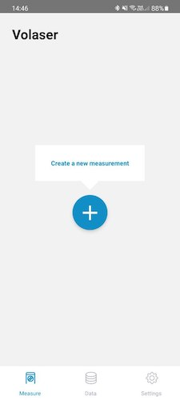
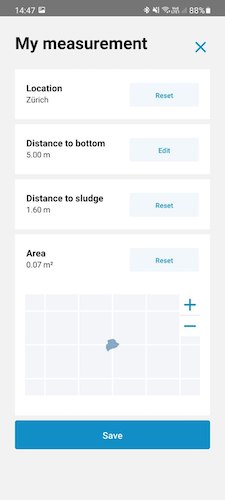
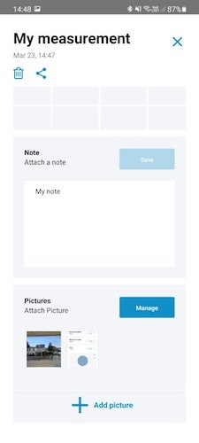
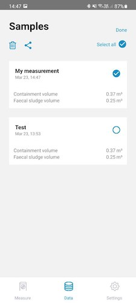
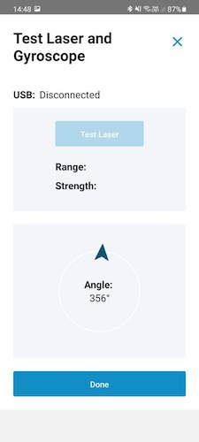

## Contents

- [Description](#description)
- [Installation](#installation)
- [Development](#development)
- [Manual](#manual)
- [Features](#features)
- [Contact](#contact)
- [Requirements](#requirements)
- [Screenshots](#screenshots)
- [License](#license)
- [Links](#links)


## Description
Understanding faecal sludge quantities and qualities (Q&Q) are essential for adequate faecal sludge management solutions. However, these are often difficult to determine, as faecal sludge is highly variable with many unknown contributing factors involved. In response to this need, the Volaser device was developed by Eawag in collaboration with ETH, ZHdK and Tribecraft AG. 

The Volaser is a device that can measure the volume of onsite sanitation containments and faecal sludge in situ. It uses a distance-laser module and a probe. The laser unit is mounted on a tripod-stand, and is operated via a smart phone app, the phone is then mounted on top of the tripod and the laser is lowered through an access port to the containment, such that the laser-unit is fully inside the containment. 

The measurement is then started in the app, and it consists in slowly rotating the shaft of the tripod-stand holding the phone. The app takes care of processing the laser data, together with its angle of rotation, to calculate the area of containment.

The distance to the sludge surface and the GPS coordinates are also recorded. 
By manually recording the depth of the contaiment thanks to a probe, is then possible to calculate the volume of the sludge of the containment.

More infos can be found [here (PDF)](https://www.eawag.ch/fileadmin/Domain1/Abteilungen/sandec/publikationen/EWM/FS_Methods_Book/Ch03.pdf)
## Installation

### Prebuild apk 
Download the latest .apk file in the release page and transfer it to your Android device. Then open the apk on the device and install the app.
You may have to allow the option "Allow App Installations from Unknown Sources" since the app is not signed and distributed outside the Google Playstore.

## Development
### Setup
Clone the git repository, install the required dependencies and run the app.
Plese note that the app is build using react-native, so the metro server must be running if you want to use the app in this way.
You must also enable Debugging over USB (please follow the docs on the [react-native website](https://reactnative.dev/docs/running-on-device)).

```
$ git clone https://github.com/volaser/volaser-app
$ cd volaser-app
$ yarn install
```
### Run the development version
```
$ yarn android
```

### Contribution
Feel free to contribute to this repo and open new PR.

Please open an issue in case of unclarities or questions.

## Manual
In order to use the Volaser application you need the Volaser setup with the external laser measurement device. 
1.  Connect the laser with the usb-c cable to your android device
2.  When you open the app, make sure that under 'Settings' > 'Test Laser and Gyroscope' the USB status is 'Connected'
3.  Start a measurement by click on 'Create a new measurement' in the tab view 'Measure'
4.  Your saved measurement can be viewed in the tab view 'Data'

## Features
- Add new measurements
- Compute area, volume and sludge volume
- Export data as CSV
- Attach notes to data points
- Attach pictures to data points

## Contact
* Nienke Andriessen <nienke.andriessen@eawag.ch>

## Requirements
### Android SDK
- Minimum Android SDK Version: *23* (i.e. Android 5.0 - Lollipop)
- Target Android SDK Version: *28* (Android 9.0 - Pie)

### Tested Hardware Android Devices
The app has been successfully tested on the following devices:
- Nexus 5X, Android 8
- Redmi Note 8, Android 9
- Samsung Galaxy A31, Android 10
- Samsung A41, Android 10
- Samsung S8, Android 9
- Samsung S21, Android 11

We try to keep the list up to date. Please inform us, if you have also successfully used the app and the laser with a phone that is not listed here.

## Screenshots






## Licenses
MIT License

Copyright (c) 2021 EAWAG

Permission is hereby granted, free of charge, to any person obtaining a copy
of this software and associated documentation files (the "Software"), to deal
in the Software without restriction, including without limitation the rights
to use, copy, modify, merge, publish, distribute, sublicense, and/or sell
copies of the Software, and to permit persons to whom the Software is
furnished to do so, subject to the following conditions:

The above copyright notice and this permission notice shall be included in all
copies or substantial portions of the Software.

THE SOFTWARE IS PROVIDED "AS IS", WITHOUT WARRANTY OF ANY KIND, EXPRESS OR
IMPLIED, INCLUDING BUT NOT LIMITED TO THE WARRANTIES OF MERCHANTABILITY,
FITNESS FOR A PARTICULAR PURPOSE AND NONINFRINGEMENT. IN NO EVENT SHALL THE
AUTHORS OR COPYRIGHT HOLDERS BE LIABLE FOR ANY CLAIM, DAMAGES OR OTHER
LIABILITY, WHETHER IN AN ACTION OF CONTRACT, TORT OR OTHERWISE, ARISING FROM,
OUT OF OR IN CONNECTION WITH THE SOFTWARE OR THE USE OR OTHER DEALINGS IN THE
SOFTWARE.

## Links
### Volaser firmware
More infos can be found in this [repo](https://github.com/volaser/volaser-firmware)
